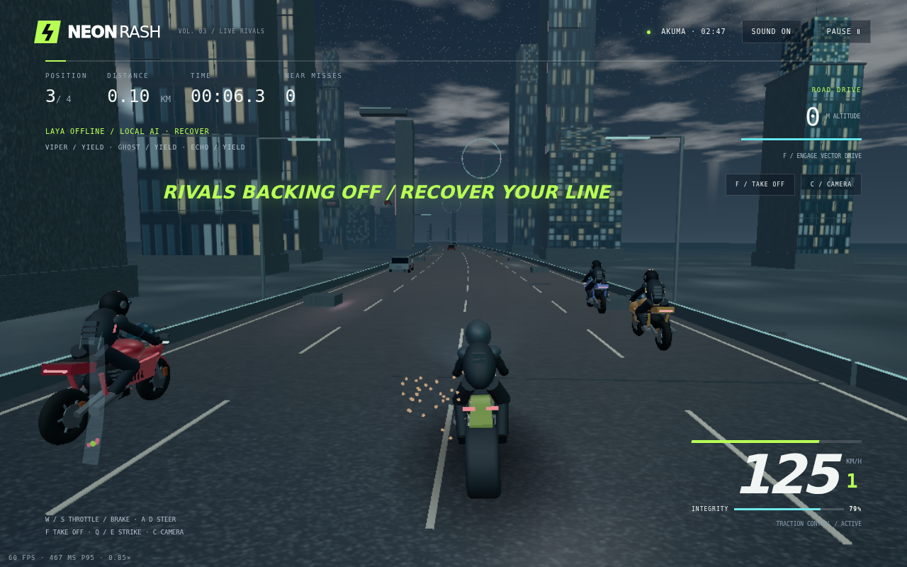
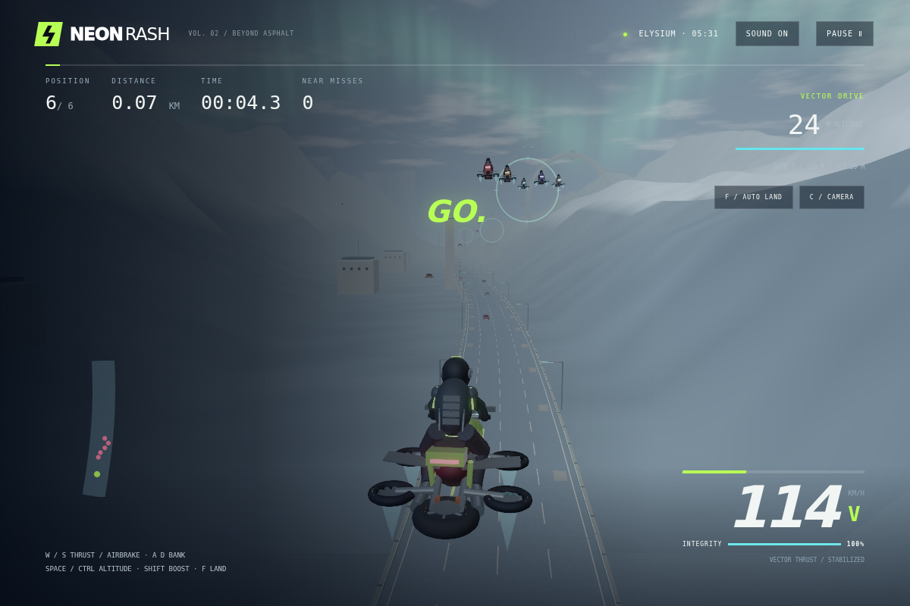
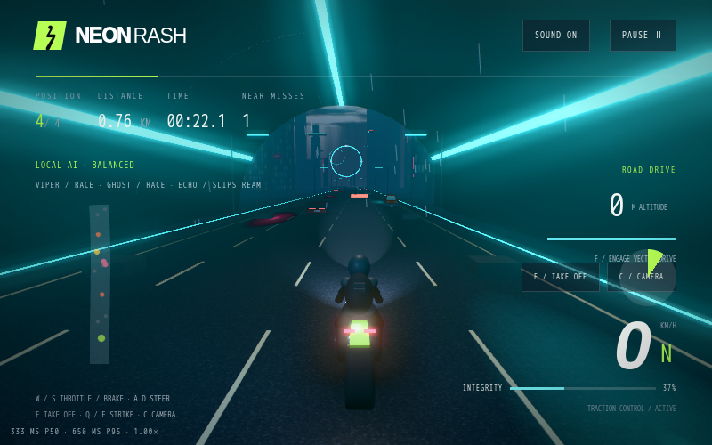
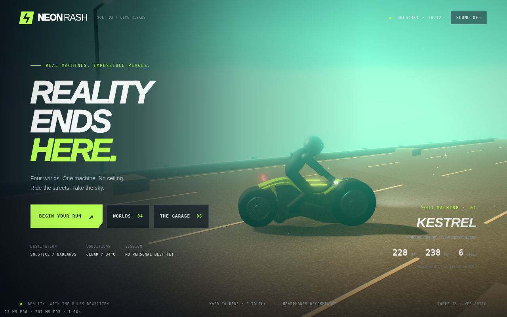
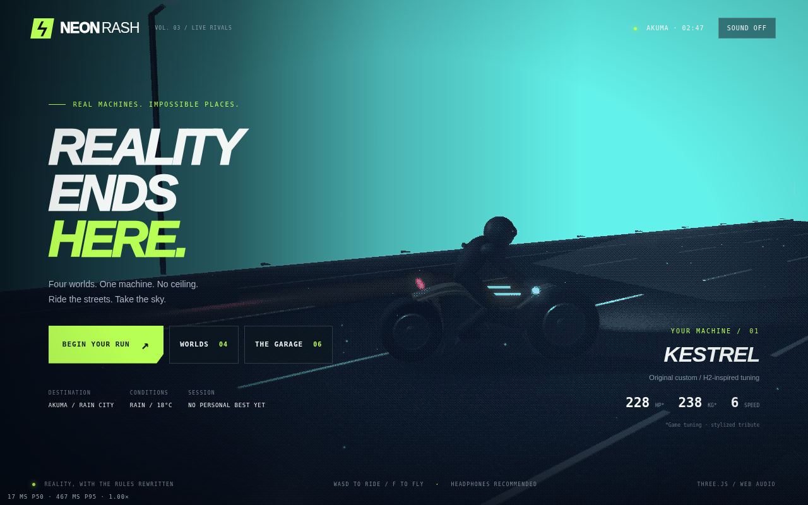
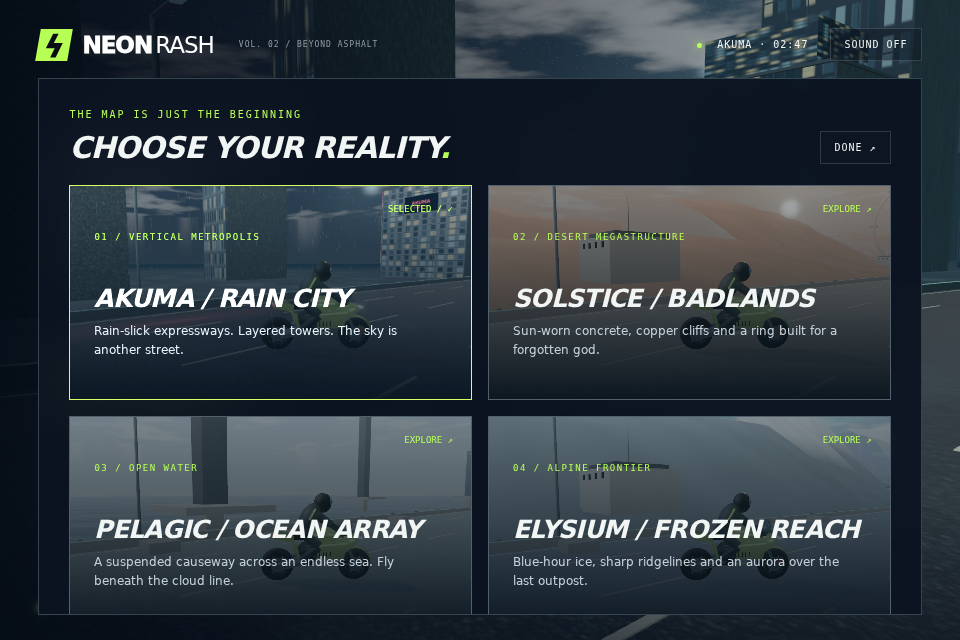
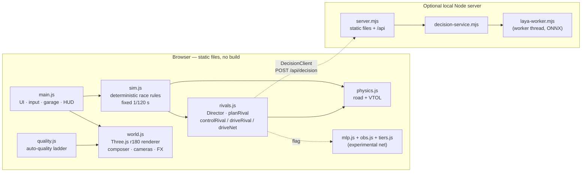

<div align="center">

# YORU 夜

**A no-build, browser-native motorcycle & VTOL racer.**<br>
Ride rain-slick expressways, deploy vector thrust, and race reactive rivals across four worlds — all in vanilla Three.js.

<sub><i>yoru</i> (夜) — Japanese for "night". Formerly developed as <i>Neon Rash</i>.</sub>

[](LICENSE)
[](vendor/THREE-LICENSE.txt)
[](#quick-start)
[](https://github.com/mdsa3d/yoru/actions/workflows/ci.yml)
[](https://mdsa3d.github.io/yoru/)


<sub>The browser link goes live once GitHub Pages is enabled for the repo. All screenshots are real renderer captures from headless
Chromium (SwiftShader software rendering); they predate the rename and show the old <i>Neon Rash</i> logo.</sub>

</div>

<table>
<tr>
<td width="33%"><br><sub>Rivals Viper / Ghost / Echo</sub></td>
<td width="33%"><br><sub>Vector drive over Elysium (earlier build)</sub></td>
<td width="33%"><br><sub>Deterministic tunnel zones</sub></td>
</tr>
<tr>
<td><br><sub>Kestrel (CC0 chassis) in Solstice</sub></td>
<td><br><sub>Optional Bayer-dither style</sub></td>
<td><br><sub>Four worlds (earlier build)</sub></td>
</tr>
</table>

## Highlights

| | |
|---|---|
| 🏍️ **Street → sky** | Six bikes, every one convertible to VTOL "vector drive": assisted take-off, altitude hold (4–95 m), boost reserve, auto-landing. |
| 🌃 **Four worlds** | Akuma / Rain City · Solstice / Badlands · Pelagic / Ocean Array · Elysium / Frozen Reach — 4 km sprint or endless freeride. |
| 🧠 **Reactive rivals** | Three rivals per race drawn from five personalities, seven tactics and a fairness **Director** (recover / balanced / pressure / duel). |
| ⚙️ **Deterministic sim** | DOM-free race rules in `src/sim.js` (seeded PRNG, fixed 1/120 s step) shared by the game, tests, dataset tools and RL trainer. |
| ✨ **Real-time rendering** | PBR + PMREM sky, bloom, per-world colour grade, GTAO, sun-following shadow re-fit, procedural road detail maps, tunnels, optional SSR. |
| 📉 **Auto-quality ladder** | 8 rungs, refresh-rate-aware budget, p95/p99 decisions with hysteresis — sheds expensive features first, resolution last. |
| 📦 **No build, no install** | Static files + vendored Three.js r180 via an import map. `node server.mjs` and play. |
| 🎵 **Synth audio** | Original Web Audio soundtrack, gear-aware engine pitch, per-world mood, Director-reactive layers. |

## Quick start

Requires **Node.js 20+** and a WebGL 2 browser with hardware acceleration. No `npm install` needed to play.

```sh
node server.mjs          # or: npm start
```

Open **http://localhost:8080** (the server binds to `127.0.0.1`; set `PORT` to change the port).
On macOS double-click `START-MAC.command`; on Windows run `START-WINDOWS.bat`.
Any static server works too (e.g. `python3 -m http.server 8080`) — but don't open `index.html` from disk.

**Static hosting:** upload `index.html`, `style.css`, `src/`, `assets/`, `vendor/` with relative paths intact.
`server.mjs` is a local development server, not a hardened production host.

## Controls

| Action | Keyboard | Gamepad¹ |
|---|---|---|
| Throttle / thrust | `W` / `↑` | RT |
| Brake / airbrake | `S` / `↓` (`Space` also brakes on the road) | LT |
| Steer / bank | `A` `D` / `←` `→` | Left stick |
| Take off / auto-land | `F` | on-screen button |
| Climb / descend (flight) | `Space` / `Ctrl` | Right stick (vertical) |
| Boost (flight) | `Shift` | LB |
| Strike left / right | `Q` / `E` | — |
| Cycle camera (3 modes) | `C` | on-screen button |
| Pause / resume | `P` / `Esc` | on-screen button |

Touch devices (`pointer: coarse`) get on-screen steering, throttle, brake, strike and flight buttons.
¹ Gamepad mapping is implemented in `src/main.js` but has **not** been tested on physical hardware.

## URL flags

| Flag | Effect | Status |
|---|---|---|
| `?bench=1` | Runs the per-feature cost harness (`src/bench.js`): baseline / FXAA / GTAO / SSR / shadows / tunnels / dither, 3 reps each, downloads `yoru-bench-<ts>.json`. | Implemented |
| `?benchMs=` `?benchWarmup=` `?benchReps=` | Override bench measure window (default 4000 ms), warm-up (1200 ms), reps (3). | Implemented |
| `?telemetry=1` | Opt-in, **local-only** 30 Hz race recorder (JSONL ring buffer, no upload). Also `localStorage` `neon-rash-v3-telemetry=1`. | Implemented |
| `?rival-physics` | Rivals drive the same `stepVehicle()` physics as the player via pure-pursuit, instead of the default kinematic controller. Also `localStorage` `neon-rash-v3-rival-physics=1`. | Experimental |
| `?rival-brain=net` | Selects the policy-net rival brain. **Only takes effect together with `?rival-physics`**, and loads an untrained placeholder — see [Rival AI](#rival-ai). | Experimental |
| `?test` | Exposes a `window.__game` diagnostics hook for the browser smoke tests. | Dev only |

## Graphics & auto-quality

The Garage offers **Adaptive** (default), **High** and **Performance**, plus per-feature toggles: shadow range, ambient occlusion (GTAO),
road detail, reflections (SSR — experimental, off by default, High only) and tunnels; and a solid / dither style.
Manual High/Performance apply fixed presets and never consult the ladder; feature toggles can only ever turn things *off*.

In **Adaptive** mode, `src/quality.js` walks an 8-rung ladder (shedding order, top to bottom):

| Rung | Label | What changes |
|---|---|---|
| 7 | `MAX` | Everything on: GTAO, 2048 shadows + per-frame frustum re-fit, detail maps, MSAA 4× |
| 6 | `HIGH` | − GTAO |
| 5 | `MID-SHADOW` | 1024 fixed-box shadows |
| 4 | `NO-DETAIL` | − road detail maps |
| 3 | `NO-DITHER` | − optional dither |
| 2 | `NO-MSAA` | MSAA off → FXAA |
| 1 | `SCALED` | render scale 0.85, 512 shadows |
| 0 | `MINIMUM` | render scale 0.6, post-processing bypassed |

- **Budget** = 1000 / measured display refresh (rAF cadence; 60 Hz until a stable cadence is seen).
- **Demote** after 2 consecutive slow windows (p95 > 1.25× budget, or p99 > 2.2× budget); **promote** after 3 headroom windows; one rung per move, then a 2-window cooldown.
- **Starting rung** comes from a heuristic GPU probe (`WEBGL_debug_renderer_info`, texture limits, memory, cores, pointer): known discrete/Apple Silicon → 7, unknown → 5, integrated/mobile/software → 2. The measured ladder corrects a wrong guess.
- Pixel ratio is capped at 1.75. SSR is never part of the ladder and never auto-enabled.

**Performance numbers:** the only real-GPU data in this repo is a single pre-fix run on an Apple M4 Pro (Chrome/ANGLE Metal, DPR 2) recorded
in [CHANGELOG 3.19.1](CHANGELOG.md): baseline p50 9.8 ms / p95 12.8 ms frame interval. It exposed a tunnel shader-recompile hitch and a dither
cost that were then fixed; the fixes have **not** been re-measured on hardware. Files under `previews/*.json` are SwiftShader software-rendering
smoke runs, **not** hardware evidence. To measure your machine, open `http://localhost:8080/?bench=1`. More in [docs/GRAPHICS.md](docs/GRAPHICS.md).

## Rival AI

| Layer | Status |
|---|---|
| Heuristic tactical rivals (5 personalities, 7 tactics, Director guardrails, skill tracker) | ✅ **Default, shipped** |
| Physics-driven rivals (`?rival-physics`) | 🧪 Experimental, opt-in |
| Learned policy net (`?rival-brain=net` + `?rival-physics`) | 🧪 Experimental, **not shipped** |
| Laya local-model tactic service | 🧪 Optional, inference not yet validated |

**The learned rival is not shipped.** A behaviour-cloning + DAgger + evolution-strategies pipeline exists (trained on the heuristic expert, not on
humans). Six candidates were evaluated against bands declared before testing; **none passed at all three difficulty tiers**, so the default brain stays
heuristic and the net flag still loads an *untrained placeholder*. Full story in [docs/RIVAL-AI.md](docs/RIVAL-AI.md).

### Optional: Laya decision service

```sh
npm run setup:laya     # CPU-only ONNX Runtime + @receptron/laya@0.1.2
npm run start:laya     # same as: node server.mjs --laya
```

Then **Garage → Rival intelligence → Laya**. First use downloads roughly **1.7 GB** of ONNX weights (per the upstream
[Laya README](https://github.com/receptron/laya)); set `LAYA_MODEL_DIR` to use a prepared local bundle. The model runs in a Node worker,
never in the render/physics loop, and only picks a tactic and pacing state — the Director and controllers still enforce motion and fairness.
Any timeout, invalid response or worker stall falls back to local rivals. Package install and import are verified; **real model inference has not been**.

## Architecture



Deeper dive: [docs/ARCHITECTURE.md](docs/ARCHITECTURE.md).

## Testing

```sh
podman run --rm -v "$PWD":/app -w /app node:20 npm test     # or docker run … / plain `npm test` with Node 20+
```

`node --test tests/*.test.mjs` — physics, flight, timing, sim determinism, rivals, tiers, MLP, telemetry, quality ladder, bench aggregation,
tunnels, shadows, materials, server and more. **153/153 passing** in the `node:20` container as of 2026-10-05. Headless browser smoke tests
(`tests/browser-v3-smoke.cjs`, Playwright + Chromium) are optional — see [VALIDATION.md](VALIDATION.md).
Other tools: `npm run bench:sim` (headless sim throughput), `node tools/eval-policy.mjs` (rival acceptance gate).

## Project structure

```text
index.html, style.css      UI shell + import map (three → vendor/)
src/                       game runtime — main, sim, physics, rivals, world, environment, models,
                           quality, bench, audio, hazards, tunnel, materials, obs, mlp, tiers, telemetry
server.mjs, server/        local dev server + optional Laya decision service
assets/                    Kestrel GLB, Kenney traffic/hazards, world thumbnails, rival-policy JSON
vendor/                    pinned Three.js r180 + addons
tests/                     Node test suites + optional browser smoke scripts
tools/                     dataset generation, eval harness, ES trainer (rl/), BC trainer (ai-train/)
previews/                  renderer captures and smoke-run metrics
docs/                      architecture, graphics and rival-AI notes
```

## Honest limits

- **Simcade**, not an engineering simulator: no articulated suspension, tyre contact patches, blade aerodynamics or ragdolls.
- Forward-travelling corridors with streamed scenery, not open worlds. Single player; no multiplayer or online leaderboard.
- Kestrel is untextured geometry with assigned materials; other bikes, riders and worlds are procedural. Not photoreal.
- Not yet tested on: hardware GPUs beyond one M4 Pro run, physical mobile devices, gamepads, Firefox/Safari.

## Roadmap

| Area | Status |
|---|---|
| Game feel, audio, graphics passes | ✅ Done |
| Rival AI depth / learned policy | 🔶 In progress — net fails acceptance bands; human telemetry never recorded |
| More worlds, bikes, hazards, track variation | 🔲 Planned |
| Progression, unlocks, race modes | 🔲 Planned |
| Multiplayer / leaderboards (needs a backend) | 🔲 Planned |
| Mobile polish on real devices | 🔲 Planned |

Details in [ROADMAP.md](ROADMAP.md) and [CHANGELOG.md](CHANGELOG.md).

## Credits

| Asset | Author | Licence |
|---|---|---|
| Kestrel chassis — *fancy motorcycle* | Teh_Bucket ([OpenGameArt](https://opengameart.org/content/fancy-motorcycle)) | CC0 1.0 |
| Traffic cars — *Car Kit* (sedan, van, taxi) | [Kenney](https://www.kenney.nl) | CC0 1.0 |
| Hazards — *Racing Kit* (barrier, fence) | [Kenney](https://www.kenney.nl) | CC0 1.0 |
| 2D simplex noise (menu backdrop) | Ashima Arts & Stefan Gustavson (webgl-noise) | MIT |
| Three.js r180 | three.js authors | MIT ([vendor/THREE-LICENSE.txt](vendor/THREE-LICENSE.txt)) |

Everything else — five procedural bikes, riders, worlds, textures, music and SFX — is original. Full provenance in [ASSETS.md](ASSETS.md).
The bikes are stylised tributes with game-tuned figures, not licensed replicas or manufacturer specs. YORU is an original Three.js game inspired by
motorcycle combat racing; it contains no code, art or audio from any other game and is not affiliated with any game publisher or manufacturer.

## Licence

Original code is licensed under the [Apache License 2.0](LICENSE). Third-party components keep their own licences as listed above.
