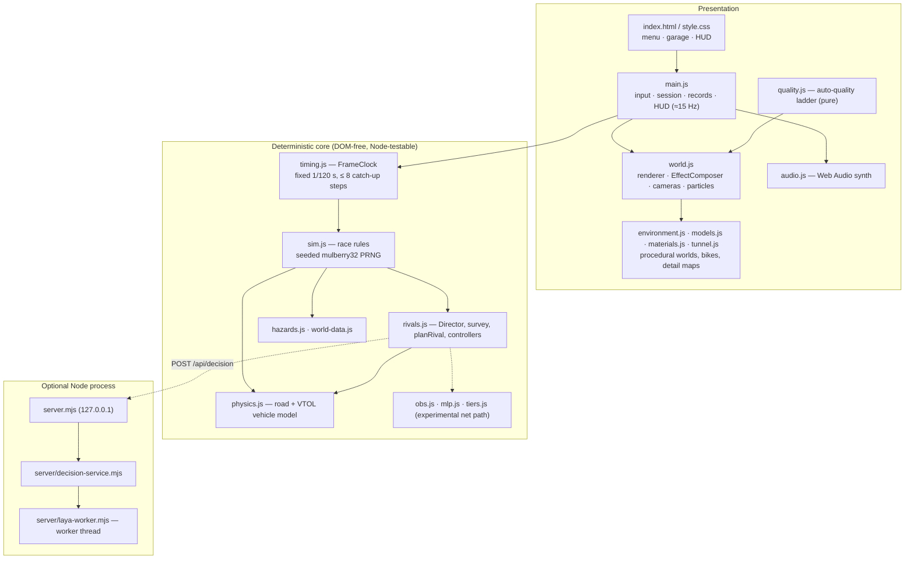

# Architecture

YORU is a static web app: `index.html` + `style.css` + ES modules in `src/`, with Three.js r180 vendored under `vendor/`
and resolved through an import map (`three` → `./vendor/three.module.js`, `three/addons/` → `./vendor/addons/`).
There is no bundler, transpiler or `npm install` step for the game itself.

## Runtime layers

## Frame loop

1. `requestAnimationFrame` → `main.js` reads keyboard / touch / gamepad into one input shape
   `{steer, throttle, brake, climb, boost}`.
2. `FrameClock.advance()` clamps the frame delta to 0.25 s, then runs at most **8** fixed **1/120 s** steps;
   anything beyond that is discarded (and counted) so a stall slows the sim instead of spiralling.
   Hit-stop scales the delta *after* the clamp.
3. Each step calls `stepSim()` in `src/sim.js`, which owns the race rules: player physics, rivals, traffic, drones,
   hazards, gates, collisions and finish. Presentation (messages, sparks, audio) is reached only through hooks.
4. `world.render()` draws an **interpolated** snapshot between the last two sim states, so render rate and sim rate are
   decoupled. The HUD and minimap refresh every ~66 ms.

## Deterministic simulation

`src/sim.js` has no DOM, network or `Math.random`: traffic respawns draw from a seeded `mulberry32`. The same module is
driven by the game, by Node tests (seeded-determinism trace hash), by `tools/sim-bench.mjs`, by dataset generation
(`tools/gen-dataset.mjs`), by the acceptance harness (`tools/eval-policy.mjs`) and by the ES trainer (`tools/rl/`).
Training and evaluation therefore run against the shipped rules, not a copy.

## Rivals and the Director

- `surveyRivals()` runs every step: leader-first order, lane-band claims, nearest-ahead draft target, duel detection,
  and which rival (if any) may strike.
- `Director` picks an encounter — `recover`, `balanced`, `pressure`, `duel` — with fairness guardrails: recovery is forced
  after damage or low health and cannot be skipped by any remote suggestion.
- `planRival()` turns personality + encounter into a tactic, target lane and speed limit. Three controllers consume that plan:
  `controlRival` (kinematic, default), `driveRival` (pure-pursuit through `stepVehicle`, `?rival-physics`) and
  `driveNet` (policy net, experimental). See [RIVAL-AI.md](RIVAL-AI.md).

## Optional Laya decision service

`server.mjs` serves only `index.html`, `style.css`, `src/`, `vendor/` and `assets/`, plus two endpoints:

| Endpoint | Behaviour |
|---|---|
| `GET /api/status` | `{laya: disabled \| loading \| ready \| unavailable}` |
| `POST /api/decision` | Same-origin only, body ≤ 4 KB, state sanitised and clamped, one request in flight; 503 when not ready |

The browser `DecisionClient` sends a compact gameplay summary at most every 0.8 s, aborts after 0.9 s, ignores answers older
than 1.6 s of sim time or from a previous race, and backs off 4 s after a failure. The worker is terminated if an inference
exceeds 2.5 s, and the service then reports `unavailable` until restart. In every failure case local rivals keep running.

## Rendering pipeline (summary)

`RenderPass` → (GTAO, SSR when enabled) → `UnrealBloomPass` → `OutputPass` → grade/chromatic-aberration/dither `ShaderPass`
→ `FXAAPass` (only when MSAA is off). Details and quality controls are in [GRAPHICS.md](GRAPHICS.md).

## Design rules worth keeping

- Gameplay state never lives in meshes; visuals read actor state.
- Pure logic (timing, sim, quality ladder, tunnels, materials, obs, tiers, MLP) stays DOM-free so it can be tested in plain Node.
- Models never run inside the render/physics loop; every model path has a deterministic fallback.
