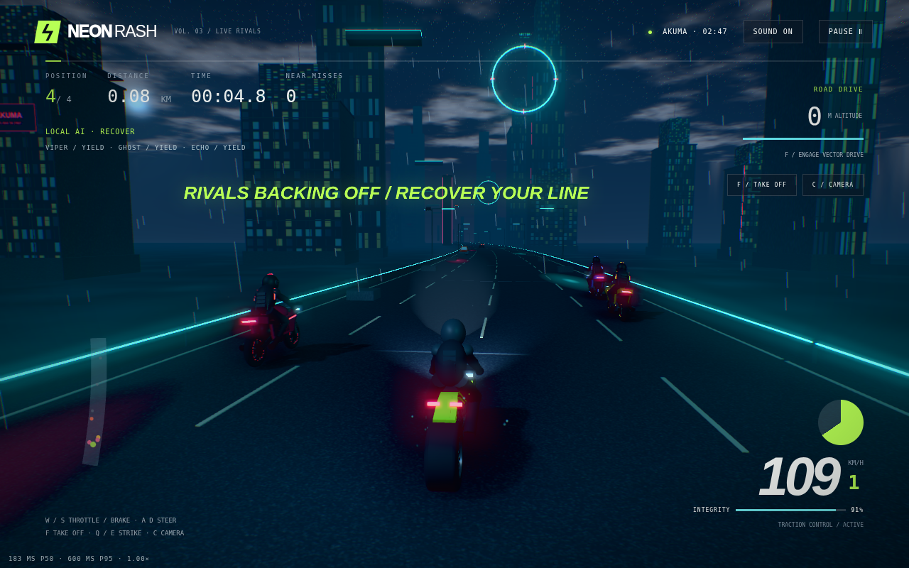
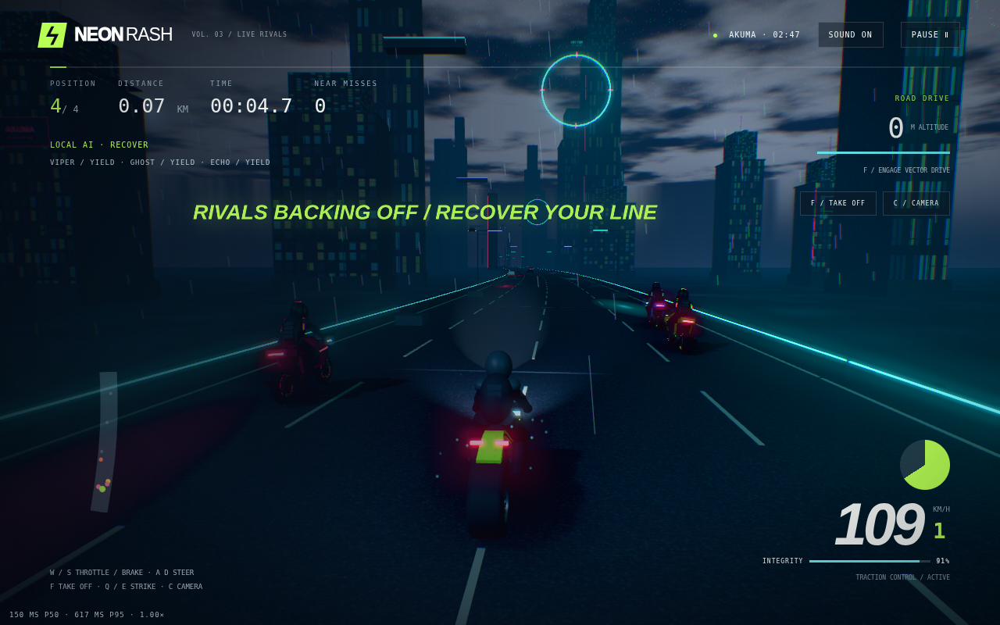

# Graphics

Everything is rendered with vanilla Three.js r180 (vendored). No HDRI, texture packs or post-processing libraries are
downloaded; the sky, road detail maps and most props are generated procedurally at runtime.

 
Akuma before / after the per-world headlight pass (CHANGELOG 3.12.0). SwiftShader captures.

## Feature set

| Feature | Notes | Default |
|---|---|---|
| PBR materials + PMREM environment | Procedural sky shader feeds environment reflections; clearcoat on bikes | On |
| Bloom | `UnrealBloomPass` | On (effects) |
| Colour grade + chromatic aberration | One stateless `ShaderPass`; per-world lift/gain/saturation; aberration reacts to hits and boost | On (effects) |
| Retro dither | Bayer 8×8 + per-world palette, merged into the grade shader (no extra pass) | Off (Garage style) |
| Shadows | Sun shadow camera re-fit to the view frustum slice each frame on top rungs; fixed box otherwise. Not CSM | On |
| GTAO | Vendored `GTAOPass`, half resolution | On (top rung only in Adaptive) |
| Road detail maps | Procedural fbm height → normal/roughness maps (`src/materials.js`) | On |
| Tunnels | Deterministic zones every 1608 m, 288 m long; visual only, no collision | On |
| SSR | Vendored `SSRPass`, half resolution, **experimental** — High quality only, never auto-enabled | Off |
| FXAA | Replaces MSAA 4× when samples drop to 0 | Ladder-controlled |
| Particles & decals | Points-based sparks, tyre smoke, rain splashes, boost trail; instanced skid marks, shadows, hazards | On |

## Quality modes

- **Adaptive** (default): the ladder below decides; Garage feature toggles can only switch features *off*.
- **High**: fixed top-rung preset; the only mode in which SSR can be enabled.
- **Performance**: fixed preset — render scale 0.85, no MSAA, 512 shadows, post-processing bypassed.

Pixel ratio is capped at `min(devicePixelRatio, 1.75)`.

## Auto-quality ladder (`src/quality.js`)

| Rung | Label | Scale | MSAA | Shadow | GTAO | Detail | Dither | Post |
|---|---|---|---|---|---|---|---|---|
| 7 | MAX | 1 | 4× | 2048 + re-fit | ✓ | ✓ | ✓ | ✓ |
| 6 | HIGH | 1 | 4× | 2048 + re-fit | – | ✓ | ✓ | ✓ |
| 5 | MID-SHADOW | 1 | 4× | 1024 | – | ✓ | ✓ | ✓ |
| 4 | NO-DETAIL | 1 | 4× | 1024 | – | – | ✓ | ✓ |
| 3 | NO-DITHER | 1 | 4× | 1024 | – | – | – | ✓ |
| 2 | NO-MSAA | 1 | FXAA | 1024 | – | – | – | ✓ |
| 1 | SCALED | 0.85 | FXAA | 512 | – | – | – | ✓ |
| 0 | MINIMUM | 0.6 | – | 512 | – | – | – | bypassed |

**Budget.** `estimateHz()` derives the display rate from the rAF cadence (accepted when p50 ≤ 18.5 ms and
p95 ≤ 1.6·p50 + 4 ms; the measured rate is used unsnapped, e.g. 102 Hz). Budget = 1000 / Hz; 60 Hz until measured.

**Decisions** (one window every ~2 s):
- slow = p95 > 1.25 × budget **or** p99 > 2.2 × budget → demote after **2** consecutive slow windows;
- headroom = p95 ≤ 0.82 × budget (or ≤ 1.12 × budget when vsync-locked) → promote after **3** windows;
- exactly one rung per move, then a **2-window cooldown**. An isolated spike changes nothing.

**Starting rung.** `probeTier()` string-matches the unmasked renderer (when the browser exposes it) and downgrades for
small texture limits, ≤ 4 GB memory, ≤ 4 cores or a coarse pointer. Known discrete/Apple Silicon → rung 7; unknown or
masked → rung 5; integrated/mobile/software → rung 2. It is an explicitly heuristic hint; measured frames correct it.

## Measuring performance

Open `/?bench=1` in a normal (non-headless) browser window. The harness drives the standard race start with manual High
quality and measures baseline, FXAA, GTAO, SSR, shadows, tunnels (driving through the first tunnel) and dither — 1.2 s
warm-up + 4 s measured, 3 reps each — then downloads a JSON file with the renderer string, DPR, resolution, estimated
refresh rate and median-run p50/p95/p99 plus spread per config.

**What the repo actually contains:**
- One real-GPU run, Apple M4 Pro (Chrome/ANGLE Metal, DPR 2, 1728×962), summarised in CHANGELOG 3.19.1:
  baseline p50 9.8 / p95 12.8 ms. That run found a tunnel light-count shader recompile (p99 70.1 ms) and a costly
  separate dither pass; both were fixed in 3.19.1 **but have not been re-measured on hardware**.
- `previews/*.json` — SwiftShader software-rendering smoke runs. They prove the harness executes; they are **not**
  hardware performance numbers.

No FPS figures are claimed for any other device. Please share `?bench=1` results if you run it.
